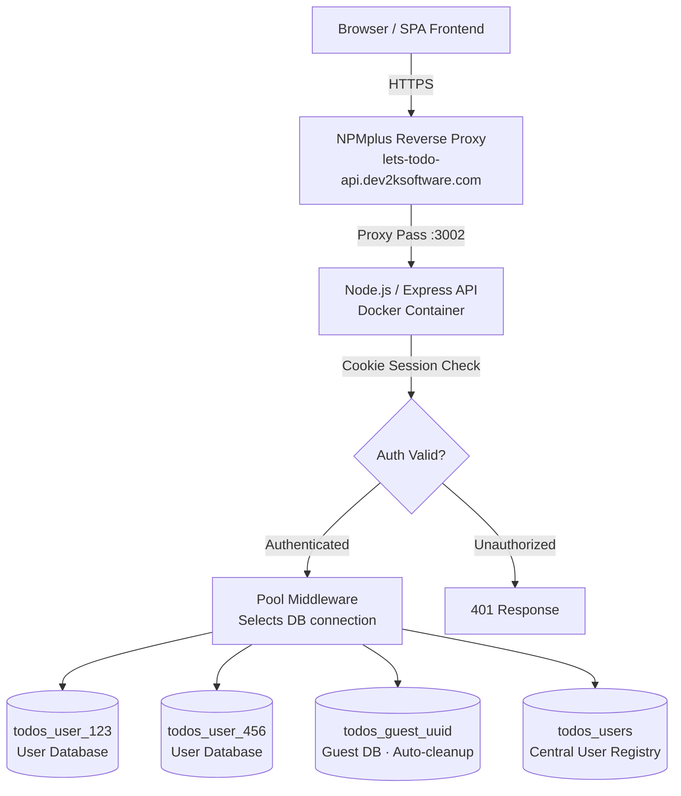

# Let's Todo API - Backend (Developer Branch)

[](https://nodejs.org/)
[](https://expressjs.com/)
[](https://mysql.com/)

> **Developer Branch**: This is the main development branch containing the latest API features and improvements. For production deployment, use the `main` branch.

**Professional Node.js Express API** with multi-environment deployment, database-per-session architecture, and automated SSL setup. This developer branch serves as the integration point for new API features and the testing ground for database optimizations.

## **Quick Access Links**

### **Live API Endpoints**

| Environment        | API Base URL                                                                           | Status          |
| ------------------ | -------------------------------------------------------------------------------------- | --------------- |
| **Production**     | [lets-todo-api.dev2ksoftware.com](https://lets-todo-api.dev2ksoftware.com)             | Stable          |
| **Feature Branch** | [lets-todo-api-feat.dev2ksoftware.com](https://lets-todo-api-feat.dev2ksoftware.com)   | Latest Features |
| **Staging**        | [lets-todo-api-stage.dev2ksoftware.com](https://lets-todo-api-stage.dev2ksoftware.com) | Testing         |

### **Documentation Hub**

| Type                  | Feature Branch                                                                 | Topics                    |
| --------------------- | ------------------------------------------------------------------------------ | ------------------------- |
| **API Documentation** | [feat/docs/](https://lets-todo-app-feat.dev2ksoftware.com/docs-api/index.html) | Endpoints, Database, Auth |
| **Frontend Docs**     | [feat/docs/](https://lets-todo-app-feat.dev2ksoftware.com/docs-app/index.html) | Components, State, UI     |
| **Architecture**      | [overview.md](.github/docs/overview.md)                                        | System Design             |
| **Deployment Guide**  | [DEPLOYMENT.md](.github/docs/DEPLOYMENT.md)                                    | Production Setup          |
| **Dev Guidelines**    | `copilot-instructions.md` (optional, local only)                               | Coding Standards          |

### **Related Repositories**

- **Frontend App**: [frontend/](https://github.com/KosMaster87/Lets-Todo/tree/main/frontend)
- **Complete Documentation**: Available in both repositories with JSDoc generation

## **Professional Branch Structure**

This repository demonstrates a professional development workflow with automated staging preparation:

| Branch                        | Purpose              | Content                                                                                                    | Audience                          |
| ----------------------------- | -------------------- | ---------------------------------------------------------------------------------------------------------- | --------------------------------- |
| **`dev`**                     | **Development**      | • Full JSDoc documentation<br>• Development scripts & tools<br>• Detailed code comments<br>• Debug logging | **Developers & Code Reviewers**   |
| **`feature/staging-prepare`** | **Demo/Process**     | • Shows cleanup transformation<br>• Automated build process<br>• DevOps pipeline example                   | **DevOps Engineers & Tech Leads** |
| **`staging`**                 | **Production-Ready** | • Clean, optimized code<br>• No debug output<br>• Deployment-ready<br>• Minimal comments                   | **Production Deployment**         |
| **`main`**                    | **Stable Release**   | • Tested production code<br>• Release documentation<br>• Version tags                                      | **End Users & Deployments**       |

### **Automated Staging Workflow**

```bash
# One-command staging preparation
pnpm run staging:prepare
```

**This automated workflow:**

1. Creates temporary `feature/staging-prepare` branch
2. Removes JSDoc documentation (2500+ lines)
3. Eliminates debug logs and development comments
4. Deletes development scripts and tools
5. Merges clean code into `staging` branch
6. Keeps demo branch for process transparency

### **JSDoc Development**

```bash
# Generate and serve API documentation
pnpm run docs # Generate JSDoc documentation
pnpm run docs:serve # Serve on http://localhost:8080
pnpm run docs:clean # Clean generated docs
```

---

## Key Features

- **Multi-Environment Architecture**: Development, Staging, Production deployments
- **Database-per-Session**: Isolated MySQL databases for each user/guest session
- **Secure Authentication**: Cookie-based sessions with bcrypt password hashing
- **Containerized Deployment**: Docker Compose (backend + dedicated MariaDB), TLS/SSL terminated upstream
- **Production Ready**: Rate limiting, security headers
- **RESTful API**: Complete CRUD operations with full session isolation
- **Multi-User Security**: Isolated server users with proper privilege separation
- **Advanced Security**: UFW firewall scripts for cloud and self-hosted setups
- **Development Tools**: Comprehensive debugging and testing utilities
- **Comprehensive Docs**: Detailed guides for development, deployment, and security

## Architecture Highlights



- **Framework**: Node.js with Express.js
- **Database**: MySQL/MariaDB with dynamic database creation
- **Authentication**: Session-based with secure HTTP-only cookies
- **Deployment**: Docker Compose container, reverse-proxied by NPMplus
- **Security**: Multi-layer protection with environment-specific configurations
- **Monitoring**: Comprehensive logging and error handling

## Quick Start

### Prerequisites

- **Node.js** 18+
- **MySQL/MariaDB** 8.0+
- **Git**

### Installation

```bash
# Clone the repository (monorepo)
git clone https://github.com/KosMaster87/Lets-Todo.git
cd lets-todo

# Install dependencies (workspace root, covers backend + frontend)
pnpm install

# Copy environment files
cp backend/config/env/.env.development.example backend/config/env/.env.development

# Setup development database (multi-environment support)
cd backend
NODE_ENV=development node scripts/setup-multi-env-db.js # Development setup (default)
NODE_ENV=staging node scripts/setup-multi-env-db.js # Staging environment setup

# Start development server
pnpm run dev
```

### Development URLs

- **Development**: http://127.0.0.1:3000
- **Staging**: http://127.0.0.1:3004 (via `docker compose up backend-staging`)
- **Production**: http://127.0.0.1:3002 (via `docker compose up backend-production`)

> **Full-Stack Setup:** Use with [Let's Todo Frontend](../frontend) for complete development experience on http://127.0.0.1:5500

## API Reference

### Authentication Endpoints

| Method | Endpoint        | Description                              |
| ------ | --------------- | ---------------------------------------- |
| `POST` | `/api/register` | Create user account + dedicated database |
| `POST` | `/api/login`    | Login user + set session cookie          |
| `POST` | `/api/logout`   | Clear session cookie                     |

### Session Management

| Method | Endpoint                 | Description                          |
| ------ | ------------------------ | ------------------------------------ |
| `POST` | `/api/session/guest`     | Start guest session + temp database  |
| `GET`  | `/api/session/validate`  | Check current session status         |
| `POST` | `/api/session/guest/end` | End guest session + cleanup database |

### Todos (Session-Isolated)

| Method   | Endpoint         | Description                       |
| -------- | ---------------- | --------------------------------- |
| `GET`    | `/api/todos`     | Get all todos for current session |
| `POST`   | `/api/todos`     | Create new todo                   |
| `GET`    | `/api/todos/:id` | Get specific todo                 |
| `PATCH`  | `/api/todos/:id` | Update todo (partial update)      |
| `DELETE` | `/api/todos/:id` | Delete todo                       |

### Development API Testing

```bash
# Register new user
curl -c cookies.txt -X POST http://127.0.0.1:3000/api/register \
  -H "Content-Type: application/json" \
  -d '{"email":"dev@test.com","password":"dev123"}'

# Login user (saves cookies)
curl -b cookies.txt -X POST http://127.0.0.1:3000/api/login \
  -H "Content-Type: application/json" \
  -d '{"email":"dev@test.com","password":"dev123"}'

# Create todo (uses saved cookies)
curl -b cookies.txt -X POST http://127.0.0.1:3000/api/todos \
  -H "Content-Type: application/json" \
  -d '{"title":"Development Todo","description":"Testing API"}'

# Get all todos
curl -b cookies.txt http://127.0.0.1:3000/api/todos

# Test guest session
curl -c guest_cookies.txt -X POST http://127.0.0.1:3000/api/session/guest
curl -b guest_cookies.txt http://127.0.0.1:3000/api/todos # Should be empty
```

## Architecture Deep Dive

### Database-per-Session Architecture

Revolutionary session isolation with dedicated databases:

```
Central Management:
├── todos_users_dev # User accounts & metadata (development)
├── todos_users # User accounts & metadata (staging/production)

User Sessions (Persistent):
├── todos_user_123 # Dedicated database for user ID 123
├── todos_user_456 # Dedicated database for user ID 456
└── todos_user_... # Each user gets own database

Guest Sessions (Temporary):
├── todos_guest_uuid1 # Temporary database for guest session
├── todos_guest_uuid2 # Automatically cleaned up on session end
└── todos_guest_... # Each guest gets own database
```

### Multi-Environment Configuration

| Environment     | Port | Domain                                  | Database          | Purpose                              |
| --------------- | ---- | --------------------------------------- | ----------------- | ------------------------------------ |
| **Development** | 3000 | `127.0.0.1:3000`                        | `todos_users_dev` | Local development with debug logging |
| **Feature**     | 3003 | `lets-todo-api-feat.dev2ksoftware.com`  | `todos_users`     | Feature testing environment          |
| **Staging**     | 3004 | `lets-todo-api-stage.dev2ksoftware.com` | `todos_users`     | Pre-production testing               |
| **Production**  | 3002 | `lets-todo-api.dev2ksoftware.com`       | `todos_users`     | Live production system               |

### Connection Pool Strategy

```javascript
// Dynamic pool management
const pools = {
  core: createPool(coreConfig), // System operations
  user: createPool(userConfig), // User data operations
  guest: createPool(guestConfig), // Guest session operations
};

// Pool middleware assigns correct pool per request
app.use(poolMiddleware); // req.pool = appropriate pool
```

## Configuration

### Environment Setup

Create environment files in `config/env/`:

```env
# config/env/.env.development
DB_HOST=127.0.0.1
DB_USER=root
DB_PASSWORD=
DB_NAME=todos_dev
DB_USERS=todos_users_dev
PORT=3000
NODE_ENV=development
DEBUG=true
LOG_LEVEL=verbose
```

### Automatic Environment Detection

The system detects environment based on:

- `NODE_ENV` environment variable
- System paths (`/home/`, `/Users/` = development)
- Database host (`127.0.0.1` = development)

## Production Deployment

### Using Docker Compose

Backend and MariaDB run as containers, defined in `docker-compose.yml` at the `lets-todo/`
workspace root (not inside `backend/`, since the build context spans the whole workspace).

```bash
cd lets-todo

# One-time: docker-compose secrets
cp .env.example .env   # fill in MARIADB_ROOT_PASSWORD

# Start the dedicated MariaDB + staging backend
docker compose up -d mariadb backend-staging

# Start the production backend
docker compose up -d backend-production

# Logs
docker compose logs -f backend-production
```

Each backend service reads its real environment file via `env_file:`
(`backend/config/env/.env.staging` / `.env.production` - never baked into the image, see
`.dockerignore`). `restart: unless-stopped` replaces PM2's process supervision; `db.js`
still exits the process on a DB connection error by design, and Docker restarts it.

### TLS / Reverse Proxy

TLS termination and reverse proxying happen upstream via NPMplus + Cloudflare Tunnel, not
inside this repository - see the Unraid infrastructure docs for the actual proxy host and
tunnel configuration.

## Security Features

- **Password Hashing**: bcrypt with salt rounds
- **SQL Injection Prevention**: Prepared statements only
- **Session Isolation**: Complete database separation per session
- **CORS Protection**: Environment-specific allowed origins
- **Environment-aware Cookies**: Secure settings per environment

## Development Workflow

### Available Scripts

| Script            | Command                              | Description                         |
| ----------------- | ------------------------------------ | ----------------------------------- |
| `pnpm run dev`    | `nodemon server.js`                  | Development server with auto-reload |
| `pnpm run dev:db` | `node scripts/setup-multi-env-db.js` | Setup/reset development database    |
| `pnpm start`      | `node server.js`                     | Production server                   |
| `pnpm run prod`   | `NODE_ENV=production pnpm start`     | Explicit production mode            |

### Multi-Environment Testing

```bash
# Test different environments locally
NODE_ENV=development pnpm start # Port 3000
NODE_ENV=staging pnpm start # Port 3004
NODE_ENV=production pnpm start # Port 3002
```

### Development Tools

**Recommended API Testing:**

- **curl** (command line) - Quick testing
- **Browser DevTools** - Network tab for cookie inspection

**Database Inspection:**

```bash
# View all user databases
mysql -e "SHOW DATABASES LIKE 'todos_%';"

# Check specific user's data
mysql todos_user_123 -e "SELECT * FROM todos;"

# Monitor guest databases (should be temporary)
mysql -e "SELECT SCHEMA_NAME FROM information_schema.SCHEMATA WHERE SCHEMA_NAME LIKE 'todos_guest_%';"
```

**Development Note:** Always include cookies in requests for authenticated endpoints. Use `-c cookies.txt` and `-b cookies.txt` with curl.

## � Security Architecture

### Authentication & Session Security

- **Password Hashing**: bcrypt with configurable salt rounds
- **Session Cookies**: HTTP-only, secure, domain-specific
- **Database Isolation**: Complete separation per user/guest session
- **SQL Injection Prevention**: Parameterized queries only

### Infrastructure Security

- **Multi-Layer Protection**: Application, database, and network level
- **Environment-Specific Settings**: Different security configs per environment
- **Rate Limiting**: API request throttling (10 req/sec with burst)
- **Security Headers**: HSTS, X-Frame-Options, CSP

### Network Security (Production)

- **Reverse Proxy**: NPMplus handles all external traffic, TLS terminated at the Cloudflare Tunnel
- **Port Isolation**: Backend containers only reachable via the Docker network and NPMplus
- **Container Isolation**: Backend and MariaDB run in separate containers on a dedicated bridge network

## Documentation

- **[Complete Setup & Deployment Guide](.github/docs/DEPLOYMENT.md)** - Local development through production deployment
- **Development Guidelines**: optional local `copilot-instructions.md` - architecture patterns and coding standards
- **[Scripts Overview](.github/docs/scripts-overview.md)** - Database management and utilities
- **[Staging Cleanup Guide](.github/docs/staging-cleanup.md)** - Automated staging preparation workflow

## Related Projects

### [Let's Todo Frontend →](../frontend)

- **Architecture**: Vanilla JavaScript ES6+ modules, no build step required
- **Integration**: Automatic environment detection and API connection
- **Session Management**: Cookie-based authentication with backend
- **Development**: Live development server on `127.0.0.1:5500`
- **Features**: Dark/light themes, PWA-ready, responsive design

## Troubleshooting

### Common Development Issues

**Database Connection Issues**

```bash
# Check if MariaDB is running
sudo systemctl status mariadb

# Test database connection
mysql -u root -p -e "SELECT 1;"

# View all todo databases
mysql -e "SHOW DATABASES LIKE 'todos_%';"

# Check specific user's database
mysql todos_user_123 -e "DESCRIBE todos;"
```

**Environment Detection Issues**

```bash
# Force specific environment
NODE_ENV=production pnpm start
NODE_ENV=staging pnpm start

# Check detected environment (shows in startup logs)
pnpm run dev

# Debug environment variables
node -e "console.log('NODE_ENV:', process.env.NODE_ENV);"
```

**Session/Cookie Issues**

```bash
# Test cookie behavior
curl -c cookies.txt -X POST http://127.0.0.1:3000/api/login \
  -H "Content-Type: application/json" \
  -d '{"email":"test@dev.local","password":"dev123"}'

# Check saved cookies
cat cookies.txt

# Test cookie usage
curl -b cookies.txt http://127.0.0.1:3000/api/session/validate
```

**Port Conflicts**

```bash
# Check what's using ports
netstat -tlnp | grep :3000

# Kill process on specific port
lsof -ti:3000 | xargs kill -9
```

### Cookie Domain Rules

- **Development**: `127.0.0.1:5500` ↔ `127.0.0.1:3000` (same domain)
- **Production**: Restricted to `.dev2ksoftware.com` domain
- **Security**: Modern browsers block insecure cookies in production

## Deployment

### Docker Compose (current)

```bash
cd lets-todo
docker compose up -d mariadb backend-staging   # staging
docker compose up -d backend-production        # production
```

CI (GitHub Actions) builds and redeploys automatically on push to `staging`/`main` via an
SSH forced-command that triggers `docker compose up -d --build` on the Unraid host - see
Phase 5 of the migration plan for details.

**Complete deployment guide:** **[DEPLOYMENT.md](.github/docs/DEPLOYMENT.md)**

## Contributing

### Development Guidelines

- Follow the **14-line function limit** rule
- Write comprehensive **JSDoc comments in English**
- Use **ES6+ modules** with proper imports/exports
- Implement **parameterized queries** for all database operations
- Test across **multiple environments** (dev, staging)
- Maintain **session isolation** in all new features

### Pull Request Process

1. **Create feature branch** from `dev`
2. **Implement feature** following the rules above and any optional local `copilot-instructions.md`
3. **Test thoroughly** across development environments
4. **Update documentation** for any new API endpoints
5. **Verify security** - no SQL injection vulnerabilities
6. **Submit pull request** with comprehensive description

### Testing Checklist

- [ ] API endpoints work with both user and guest sessions
- [ ] Database isolation maintained between sessions
- [ ] Proper error handling and logging
- [ ] Cookie-based authentication functions correctly
- [ ] Cross-environment compatibility verified

## Roadmap

### Planned Features

- [ ] WebSocket integration for real-time updates
- [ ] Advanced caching strategies with Redis
- [ ] API versioning system (v2 endpoints)
- [ ] Enhanced monitoring and analytics
- [ ] OAuth integration experiments

### Technical Improvements

- [ ] Database connection pool optimization
- [ ] Enhanced error tracking and reporting
- [ ] Performance monitoring dashboards
- [ ] Automated security scanning
- [ ] Advanced rate limiting strategies

## License

No project license file is currently included. `package.json` declares ISC, while an older
README version advertised MIT; confirm the intended project license separately.

## Support

For questions, issues, or contributions:

1. **Check Documentation**: Review `.github/docs/DEPLOYMENT.md` and any optional local `copilot-instructions.md`
2. **Review Troubleshooting**: Common issues section above
3. **Create GitHub Issue**: For bugs or feature requests
4. **Contact Development Team**: For urgent support needs

---

**Built with for modern full-stack development**

**Happy coding!**
